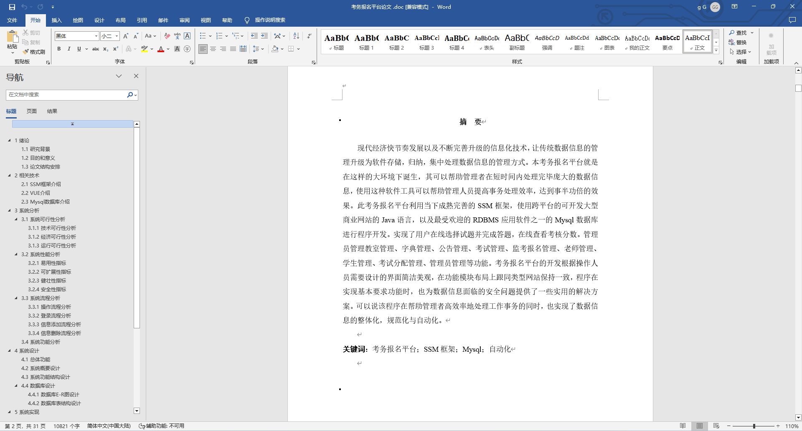
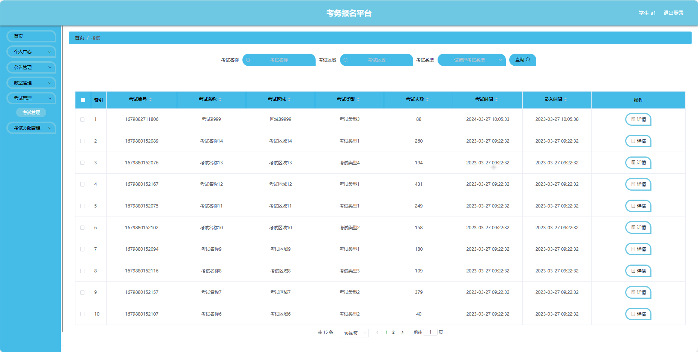
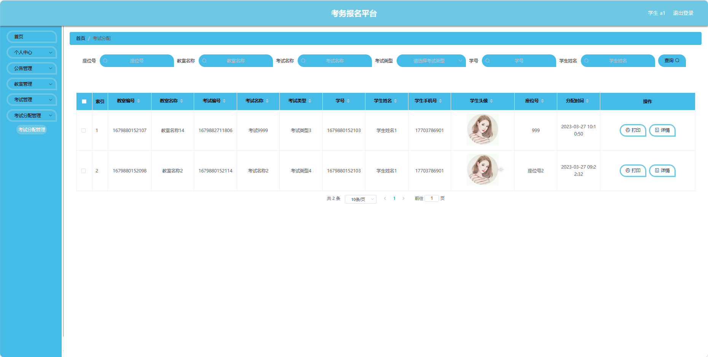
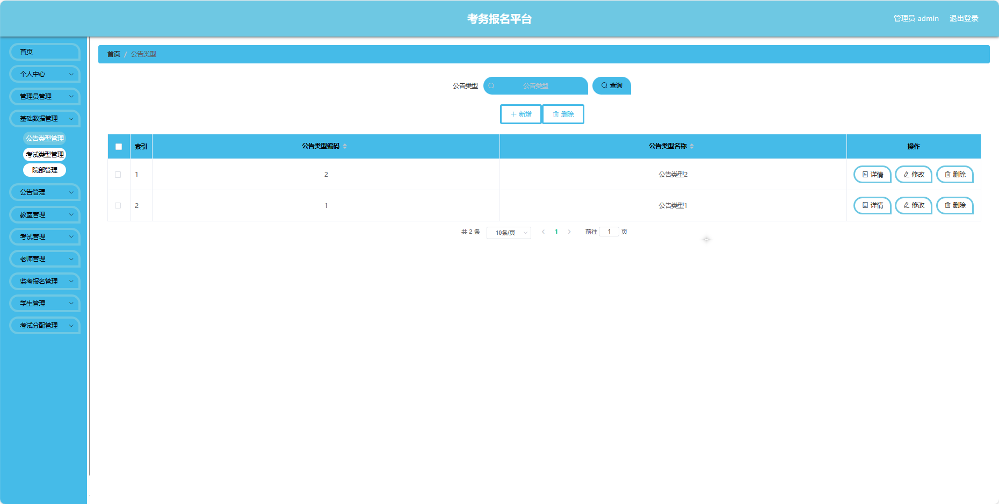
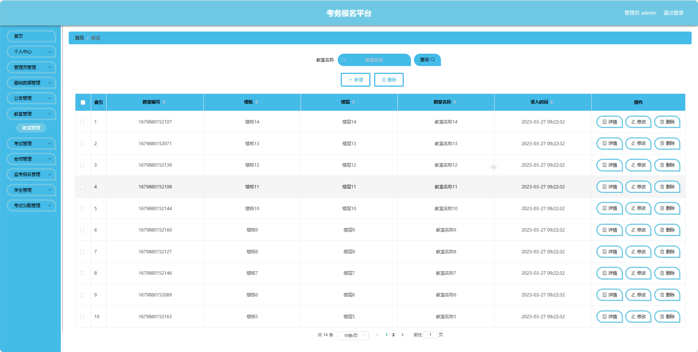
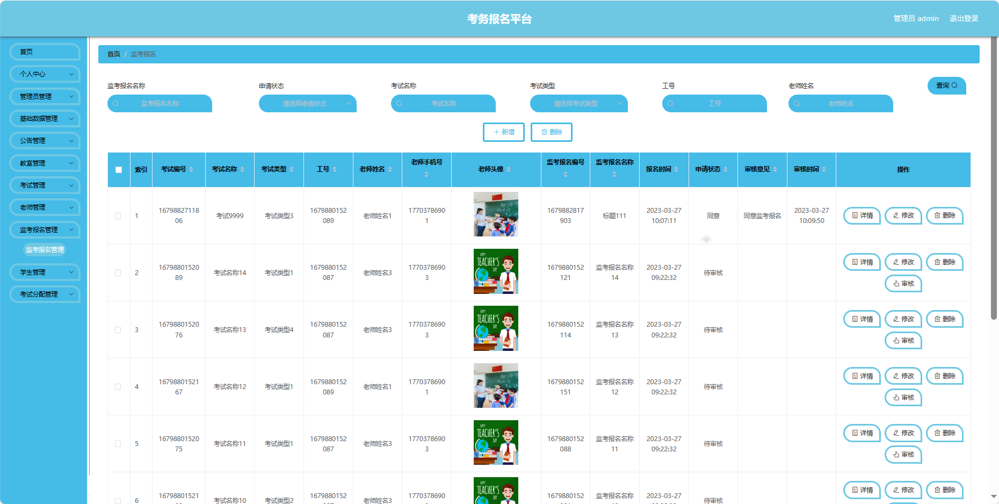
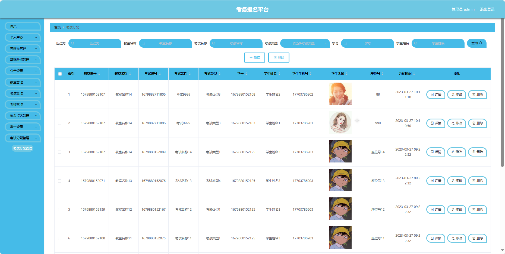
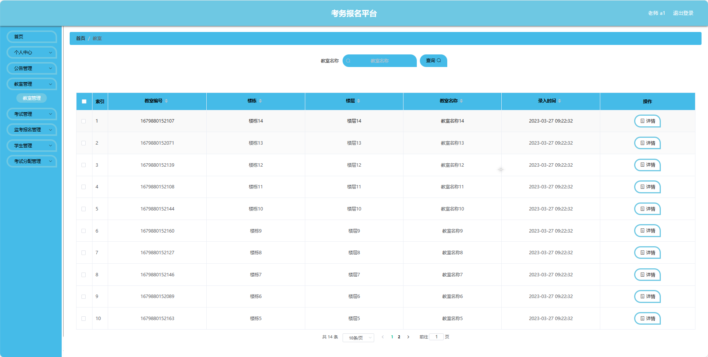
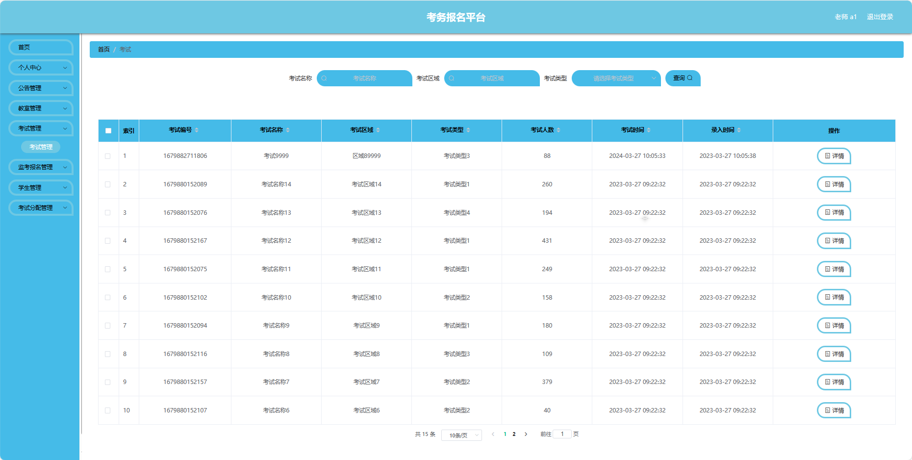

## 基于SpringBoot的考务报名平台(程序+报告)

- <b>完整代码获取地址：从戎源码网 ([https://armycodes.com/](https://armycodes.com/))</b>
- <b>技术探讨、资料分享，请加QQ群：692619798</b> 
- <b>作者微信：19941326836  QQ：952045282</b> 
- <b>承接计算机毕业设计、Java毕业设计、Python毕业设计、深度学习、机器学习</b>
- <b>选题+开题报告+任务书+程序定制+安装调试+论文+答辩ppt 一条龙服务</b>
- <b>所有选题地址 ([https://github.com/YuLin-Coder/AllProjectCatalog](https://github.com/YuLin-Coder/AllProjectCatalog)) </b>

## 项目介绍
基于SpringBoot的考务报名平台，系统包含三种角色：管理员、用户,教师主要功能如下。

【用户功能】

1. **首页：** 显示信息。
2. **个人中心：**
   - **修改密码：** 修改用户账户的登录密码。
   - **个人信息：** 查看和编辑个人基本信息。
3. **公告管理：** 查看公告信息，。
4. **教室管理：** 查看考试所在的教室信息。
5. **考试管理：** 查看已报名的考试列表。
6. **考试分配管理：** 查看考试分配情况。

【管理员功能】

1. **首页：** 显示系统的整体概况。
2. **个人中心：**
   - **修改密码：** 修改管理员账户的登录密码。
   - **个人信息：** 查看和编辑管理员的基本信息。
3. **管理员管理：** 管理系统中的管理员账户。
4. **基础数据管理：**
   - **公告类型管理：** 维护通知公告的分类。
   - **考试类型管理：** 维护不同类型的考试。
   - **院部管理：** 维护不同院部的信息，用于考试分配。
5. **公告管理：** 发布和管理考试相关的通知公告。
6. **教室管理：** 维护考试所使用的教室信息。
7. **考试管理：** 创建、编辑和删除考试信息，考试时间、地点、科目等。
8. **老师管理：** 管理监考老师的信息，包括分配监考任务。
9. **监考报名管理：** 查看和管理老师的监考报名情况。
10. **学生管理：** 查看和管理学生的考试报名情况。
11. **考试分配管理：** 分配考生到具体的考场和座位。

【教师功能】

1. **首页：** 显示信息。
2. **个人中心：**
   - **修改密码：** 修改教师账户的登录密码。
   - **个人信息：** 查看和编辑教师的基本信息。
3. **公告管理：** 查看公告信息。
4. **教室管理：** 查看监考所在的教室信息。
5. **考试管理：** 查看负责的监考任务。
6. **监考报名管理：** 查看自己的监考报名情况。
7. **学生管理：** 查看参与监考的学生名单。
8. **考试分配管理：** 查看和管理学生的考试分配情况。

## 项目技术
- 编程语言：Java
- 数据库：MySQL
- 项目管理工具：Maven
- 前端技术：HTML、CSS、JavaScript、Jquery、Vue
- 后端技术：Spring、SpringMVC、MyBatis

## 运行环境
- JDK版本：JDK1.8及以上
- 开发工具：IDEA、Ecplise、Myecplise都可以
- 数据库: MySQL5.7及以上
- Maven：maven3.0及以上
- Node：14.14.0及以上

## 运行截图

